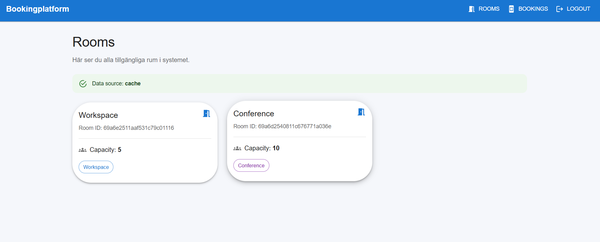
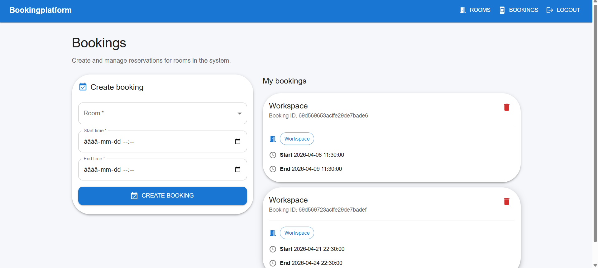

Bokningsplattform

En fullstack bokningsplattform där användare kan boka rum i realtid.

🚀 Funktioner
- Registrera och logga in användare (JWT-auth)
- Roller: User och Admin
- Visa alla rum (med Redis-cache)
- Skapa, uppdatera och ta bort bokningar
- Admin kan skapa, uppdatera och ta bort rum
- Realtidsuppdateringar med Socket.io
- Modern frontend med React + MUI

🧱 Tech stack

Backend
- Node.js
- Express
- MongoDB (Mongoose)
- Redis (cache)
- Socket.io
- JWT (auth)

Frontend
- React (Vite)
- Material UI (MUI)
- Axios
- React Router
- Socket.io-client

⚙️ Installation
1. Klona projektet
git clone <repo-url>
cd bokningsplattform

2. Backend
npm install
npm run dev

Se till att:
- MongoDB kör på: mongodb://127.0.0.1:27017
- Redis kör på: redis://127.0.0.1:6379

3. Frontend
cd frontend
npm install
npm run dev

Frontend kör på:
http://localhost:5173

🔐 Auth
- JWT används för autentisering
- Token lagras i localStorage
- Protected routes i frontend

🧠 Arkitektur

Backend är uppdelad i:

- controllers → hanterar requests
- services → affärslogik (t.ex. booking rules)
- models → MongoDB schema
- middleware → auth & error handling
- config → DB & Redis
- utils → logger, errors

Frontend är uppdelad i:
- pages → Login, Rooms, Bookings
- components → Navbar, ProtectedRoute
- api → axios & socket

⚡ Redis Cache
- GET /rooms cachas i Redis
- TTL: 60 sekunder
- Cache invalidieras vid:
* create room
* update room
* delete room

🔄 Realtid (Socket.io)

Events:

booking
booking
booking

Frontend uppdateras automatiskt utan refresh.

📸 Screenshots

🧪 Testning

- Testad via Thunder Client / Postman
- Testad i frontend (React)
- Testat:
* auth
* CRUD rooms
* CRUD bookings
* cache
* realtime events

👤 Developer
[ Redir Idris ]

